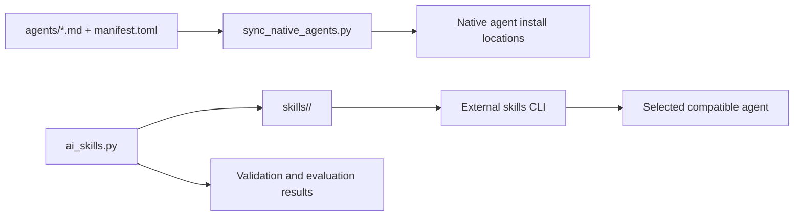
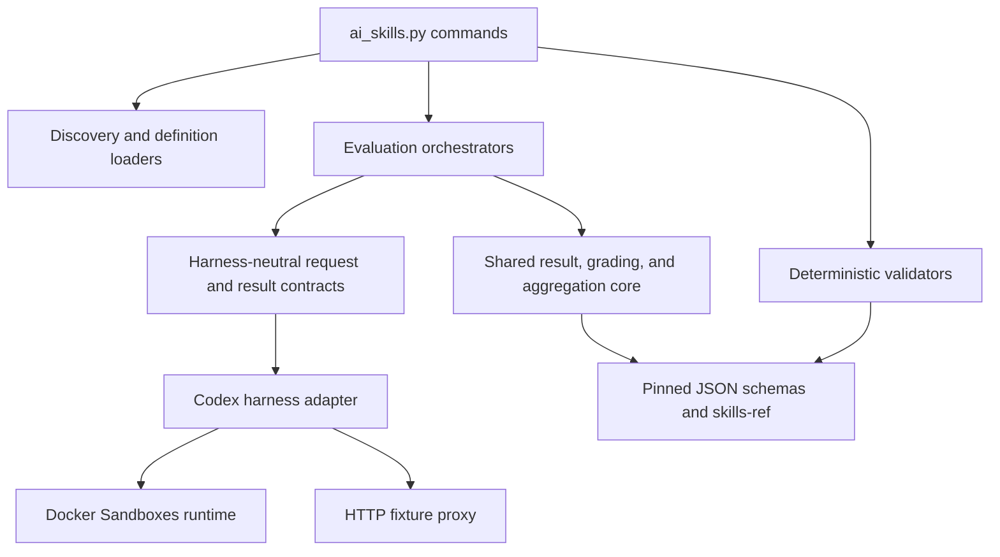
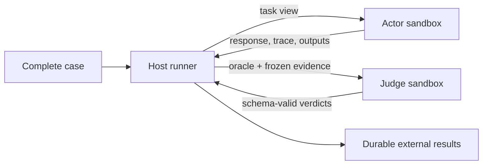

# Architecture

The repository has three products that share one source tree:

1. Portable Agent Skills installed by an external package manager.
2. Native-agent prompts synchronized by a repository tool.
3. A repository CLI that validates and evaluates skills.

## Repository Map

```text
skills/                         canonical installable skills
agents/                         canonical native-agent prompts and manifest
scripts/ai_skills.py            repository CLI entry point
scripts/ai_skills_lib/          validation and evaluation implementation
schemas/ai-skills/              authored and generated JSON contracts
config/eval-runtime.json        immutable model-runtime pins and limits
tests/ai_skills/                generic deterministic harness tests
tests/runtime/                  bundled-script behavior tests
tests/integration/eval_runtime/ opt-in real runtime smoke tests
docs/                           user, author, evaluation, and architecture guides
```

The source of every skill is exactly one folder under
`skills/<group>/<skill>/`. Group folders aid navigation; skill folders are the
installable units.



Installed copies are delivery artifacts. Repository code never treats them as
source and never repairs them automatically.

## CLI Layers

The Python CLI follows a small set of boundaries:



- Discovery finds every skill from the canonical layout.
- Definition loaders validate and convert `evals.json` and `triggers.json` into
  typed runner inputs.
- Deterministic validators are filesystem- and schema-oriented. They do not
  invoke models. One shared entry-and-byte budget bounds all authored-tree
  discovery, validation, and stable file reads in a validation run.
- Evaluation orchestrators declare the complete attempt set before preflight,
  bind one preflight receipt to the exact adapter and immutable declarations,
  pin the actor and judge model configurations reported by preflight, schedule
  work, and aggregate results. Runtime capabilities cannot be supplied without
  that receipt, and every bound request explicitly passes those pins.
- The harness protocol separates orchestration from agent-specific execution.
- The Codex adapter projects skills, stages actor inputs, launches Codex, and
  normalizes observable evidence.
- Shared result, schema, and aggregation code is runner-neutral. Behavior
  orchestration owns semantic judge preparation and invocation; trigger
  orchestration uses deterministic activation grading.
- Shared actor-evidence code freezes responses, traces, and actor-created
  outputs for both behavior and trigger attempts before they can be graded.

Code consumed by multiple runners belongs in a shared core or library module.
Runner-specific modules own their definitions and orchestration. The harness
adapter boundary lets a future Claude implementation reuse result and fixture
contracts without duplicating them. Claude is represented at the CLI boundary
but is not yet a supported model-backed adapter.

## Runtime Views

The runtime deliberately creates different views of one case:

| View | Can see | Cannot see |
| --- | --- | --- |
| Actor | User prompt, runtime skill catalog, declared input files, normal tools | Expected result, assertions, schemas, grades, proxy controls |
| Runner | Complete case definition, runtime controls, exact evidence, result directory | Hidden model reasoning |
| Judge | Expected result, assertions, bounded frozen actor evidence | Skills, actor workspace, shell, web, fixture controls |

The runner enforces these views through separate sandbox workers, distinct
filesystem projections, runner-owned prompts, and schema-constrained judge
output. The distinction is architectural, not a prompt convention.
Every host child process receives closed standard input. Actor and judge prompts
are supplied explicitly, so a calling terminal cannot become undeclared model
input or keep a headless Codex turn waiting for more text.

Case files are staged through the worker's host projection, then copied into a
quota-bound tmpfs before execution. A root-only bridge under
`/run/ai-skills-evals/` keeps the underlying host projection available to the
runner for verified import and export without making that bridge traversable by
the case user. The worker's ordinary host projection receives one protective
bind mount while a case is active. The runner reuses that bind while the sandbox
kernel remains running or recreates it after a restart, remounts it read-only
for execution, and returns it to read-write only after cleanup. This prevents an
actor from bypassing the tmpfs quota through Docker's host mount.

Before every actor or judge command, the runner inspects the worker mount table
as the case user. The five case-owned tmpfs mounts are the only ordinary
writable filesystems permitted. Kernel-owned `/proc`, `/sys`, and `/dev`
pseudo-filesystems use a narrow filesystem-type allowlist; every other mounted
filesystem is recursively checked instead of being skipped at a device
boundary. A writable secondary mount, an unexpected mount below the case tmpfs,
or an uninspectable actor-traversable mount recycles the worker before execution.

The runner seals public skill entries only after importing them into the case
tmpfs. Each public entry is root-owned and verified as immutable. The catalog
root is a root-owned sticky directory: Codex can replace its actor-owned
`.system` entry, but cannot rename, delete, or edit a public skill.



## Sandbox Lifecycle

Docker Sandboxes provide isolated microVMs. The runner creates role-specific
worker pools and gives every attempt a fresh case identity and writable state.
Workers are reused only after reset verification; uncertain workers are
destroyed. Pinned templates, images, network policy, resource limits, and
runtime versions make runs repeatable.

Case quiescence proves the cgroup empty before export and removes it after the
case filesystem is deactivated. Later case retirement cleans only persistent
identity and staging state, so reuse does not depend on kernel state surviving
a Docker Sandbox stop and restart. Volatile scratch targets such as `/run/lock`
are recreated empty before residual-UID checks.
The fixed cgroup scripts communicate success through exit code `0` and empty
stdout. Non-fatal host warnings emitted by the `sbx` wrapper on stderr do not
override that proof; timeouts, nonzero exits, truncation, or unexpected script
stdout remain hard failures.

The runner reconciles each worker's name and UUID from `sbx ls`. The UUID is
the authoritative internal identity used to track case state and prove exact
cleanup; the verified name is the address passed to Docker Sandbox commands
such as `sbx exec` and `sbx rm`. Post-removal verification requires both that
UUID and its verified name to be absent; a same-name replacement quarantines
the cleanup target and preserves its staging state.

Authentication remains in Docker Sandboxes' host proxy. A case receives a
non-secret proxy profile and placeholder, never the user's Codex home,
`auth.json`, browser state, SSH keys, or service credentials. The generated
profile is checked byte-for-byte and structurally against the output pinned for
the configured Docker Sandbox template before it enters a case.

See [Evaluation: Sandboxes, workers, and cases](EVALUATION.md#sandboxes-workers-and-cases)
for lifecycle diagrams and operational commands.

## Integration Boundary

Case fixtures model only the interfaces a task needs. Declared files enter the
actor workspace; declared commands enter its `PATH`; proxy-aware actor commands
receive a worker-local MockServer proxy configuration. The host runner alone
controls MockServer expectations, verification, reset, and ephemeral
certificate material. It stages the authenticated control payloads before the
first actor command. The actor projection remains read-only while evidence is
collected; collection cannot mutate proxy controls or case inputs.

MockServer's no-passthrough guarantee applies to requests that reach that
proxy. It is not the worker's general egress firewall; the pinned sandbox
network policy governs other traffic. Cases never receive real third-party
credentials or private sessions.

Fixture preflight reads MockServer's authenticated live configuration, requires
unmatched proxying to be disabled, and sends an unmatched request toward a
disposable same-image canary. Preflight succeeds only when the request returns
404 and the canary records no request. It also attempts the real reset method
without credentials and verifies a sentinel expectation remains unchanged. The
actor-visible probes run in a dedicated fixture-preflight case. The runtime
quiesces and deactivates that case before the fixture proxy destroys its
sidecar, control directory, and generated CA. Later Codex capability probes use
a fresh case and cannot inherit fixture-preflight state. A quiescence,
retirement, or reset failure invalidates the worker and drops its fixture state.

Each actor worker owns at most one MockServer container. Multiple workers can
therefore serve the same loopback port concurrently because their networks are
isolated. A sidecar serves exactly one fixture case. Dynamic certificate
updates and Docker log persistence remain disabled, so actor request volume
cannot create unbounded worker logs. Before actor execution, the runner configures the
exact declared DNS and IP subject names and proves each one with a real
certificate-validating HTTPS handshake. Successful collection destroys the
sidecar and its generated certificate directory. The worker may be reused, but
its next fixture case receives a fresh sidecar and a different generated CA.
Failed teardown, repeated CA state, or failed hostname verification invalidates
the worker.

See [Evaluation: Fixtures and integrations](EVALUATION.md#fixtures-and-integrations)
for request and certificate diagrams.

## Evidence And Results

The adapter converts harness output into a normalized execution record. Safe
response text, transcript events, command lifecycle, exact successful skill
reads, token usage, timing, and changed output files can become evidence.
Hidden reasoning, raw skill bodies, private thread identifiers, and unbounded
command output do not.

Trigger pickup is derived from the normalized lifecycle rather than trusted as
a standalone marker. A skill read is admissible only when it is bound by
command ID to a matched `cat` or `sed` start and successful completion inside
one complete actor thread and turn. Non-command tool events are paired by ID
and type, and unknown lifecycle events are rejected. The same derivation runs
live and during offline aggregation.

Actor evidence used for grading must remain exact. Content that would require
secret redaction, truncation, or silent omission is quarantined and the attempt
becomes untrustworthy. The runner never grades transformed content as if it
were the actor's real output. Captured output pathnames and file bytes share a
bounded sensitive-content scan; any finding or incomplete scan fails the
attempt before grading. Runner control-plane telemetry, including proxy request
metadata, is separately bounded and sanitized before persistence. Behavior
grades contain a digest of the exact actor-created output tree.
Completion and aggregation independently verify that digest; output drift
removes or invalidates the grading completion marker. Harness failures are
reduced to bounded, secret-safe diagnostics before they enter results or
summaries. Before an incomplete attempt is finalized, the shared artifact
writer clears actor-created files through the pinned `outputs/` directory
handle; only the separately scanned runner-owned response is written back.

Invocation and attempt manifests declare the expected result tree before
external execution, including an immutable assertion contract and a digest of
the exact prepared skill catalog, actor inputs, fixture initialization, prompts,
judge controls, and deterministic schemas. The runner verifies those bytes
before and after preflight and returns a receipt bound to the invocation inode,
content digest, command, and fixture requirement. A fresh random invocation
identity is repeated in every structured attempt artifact and included in the
grade's complete evidence digest, preventing stale successful artifacts from
being substituted into a later run. Aggregation also requires one actor harness
and model configuration, and one generated judge configuration, across the
complete invocation. Behavior runs preserve the
exact schema-valid judge
response, judge controls, prompt digest, admitted evidence set, deterministic
definitions, schemas, and results in `grading_basis.json`. Aggregation rebuilds
the judge prompt from the preserved actor-only evidence, validates the isolated
judge lifecycle, reparses the judge response, and independently reruns each
deterministic check against snapshotted evidence. Rewritten verdicts are
rejected. Trigger runs bind activation evidence to the canonical installed
Codex catalog path and the exact bytes returned by a trusted system reader.
Aggregation verifies these declarations so missing, injected, substituted, or
rewritten evidence cannot silently influence a benchmark.

Persisted model and reasoning fields identify the exact configuration passed
to the pinned harness through the bound request. Codex JSONL does not include
an independent backend model identity, so these fields are configuration
evidence rather than backend-routing attestation.

All actor-visible skill, input, and fixture bytes are prepared before runtime
preflight. The concrete adapter rejects live repository paths, recomputes the
canonical request digest immediately before execution, and runs only when it
still matches the runner-created execution binding.
Judge response schemas are detached into one bounded canonical byte snapshot
before binding; the adapter validates and stages those exact bytes without
re-reading caller-owned mappings.

Result creation and replacement use descriptor-anchored writes beneath pinned
result, attempts, attempt, and artifact-directory identities. Codex output
capture populates the existing pinned `outputs/` directory instead of replacing
it. Reads, writes, completion-marker removal, and output restoration stop if
any ancestor identity changes, so pathname replacement cannot redirect work or
delete a substituted directory.

Successful judge traces are preserved as bounded runner evidence. A judge run
must expose exactly one supported successful lifecycle: the normalized Codex
thread-start, turn-start, turn-complete sequence, or the runner's single
test-adapter completion event. Missing, reordered, additional, or structured
events fail both live grading and offline aggregation. Codex bundled skills and
skill instructions are disabled for judges, and the runner verifies their skill
catalog is empty immediately before and after execution. The actor trace retains
its own per-artifact limit; the small judge lifecycle suffix has a separate
bound.

## Configuration And Pins

`config/eval-runtime.json` owns runtime templates, Codex and MockServer images,
network-policy digests, timeouts, resource limits, evidence bounds, and
concurrency-related runtime settings. Runtime pins are immutable; floating
tags, package ranges, and runtime schema downloads are not accepted.

`schemas/ai-skills/` contains the checked-in JSON contracts for authored evals
and triggers and for generated invocation, attempt, timing, grading, and
benchmark artifacts. The version-matched MockServer schema is also vendored so
offline validation does not depend on runtime downloads.

Changes to runtime pins or trust boundaries require deterministic tests,
documentation updates, and a recommendation to run the separately approved
real integration smoke suite.
