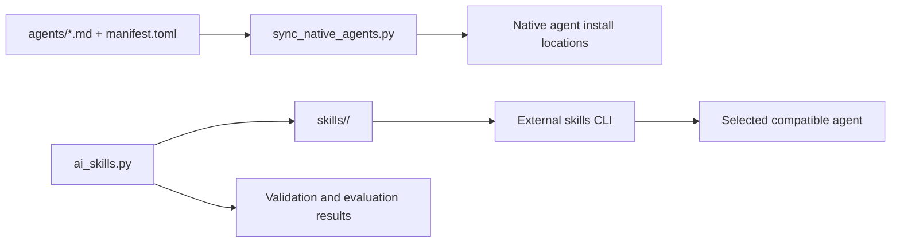
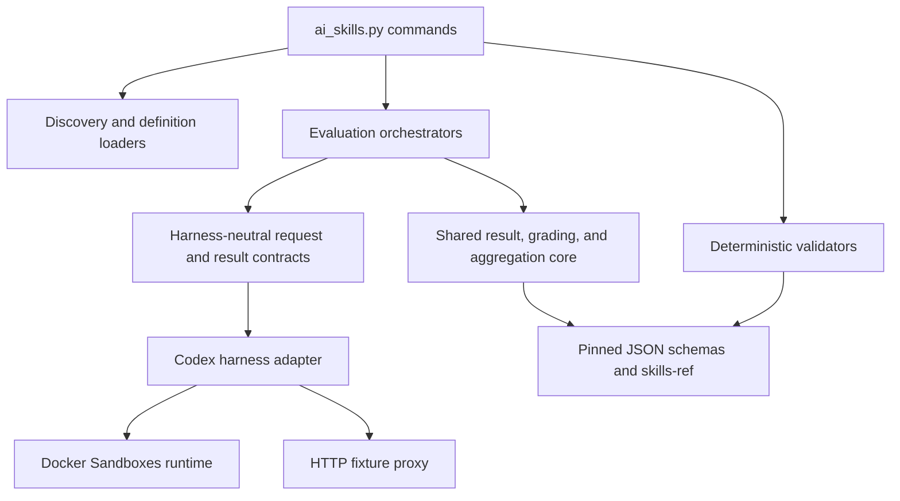
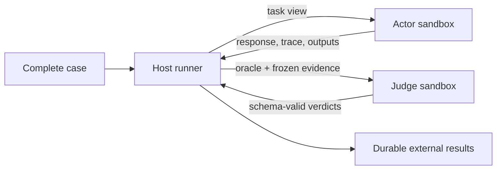

# Architecture

The repository has three products that share one source tree:

1. Portable Agent Skills installed by an external package manager.
2. Native-agent prompts synchronized by a repository tool.
3. A repository CLI that validates and evaluates skills.

## Repository Map

```text
skills/                         canonical installable skills
agents/                         canonical native-agent prompts and manifest
scripts/ai_skills.py            repository CLI entry point
scripts/ai_skills_lib/          validation and evaluation implementation
schemas/ai-skills/              authored and generated JSON contracts
config/eval-runtime.json        immutable model-runtime pins and limits
tests/ai_skills/                generic deterministic harness tests
tests/runtime/                  bundled-script behavior tests
tests/integration/eval_runtime/ opt-in real runtime smoke tests
docs/                           user, author, evaluation, and architecture guides
```

The source of every skill is exactly one folder under
`skills/<group>/<skill>/`. Group folders aid navigation; skill folders are the
installable units.



Installed copies are delivery artifacts. Repository code never treats them as
source and never repairs them automatically.

## CLI Layers

The Python CLI follows a small set of boundaries:



- Discovery finds every skill from the canonical layout.
- Definition loaders validate and convert `evals.json` and `triggers.json` into
  typed runner inputs.
- Deterministic validators are filesystem- and schema-oriented. They do not
  invoke models.
- Evaluation orchestrators declare the complete attempt set before preflight,
  schedule work, and aggregate results.
- The harness protocol separates orchestration from agent-specific execution.
- The Codex adapter projects skills, stages actor inputs, launches Codex, and
  normalizes observable evidence.
- Shared result, schema, and aggregation code is runner-neutral. Behavior
  orchestration owns semantic judge preparation and invocation; trigger
  orchestration uses deterministic activation grading.

Code consumed by multiple runners belongs in a shared core or library module.
Runner-specific modules own their definitions and orchestration. The harness
adapter boundary lets a future Claude implementation reuse result and fixture
contracts without duplicating them. Claude is represented at the CLI boundary
but is not yet a supported model-backed adapter.

## Runtime Views

The runtime deliberately creates different views of one case:

| View | Can see | Cannot see |
| --- | --- | --- |
| Actor | User prompt, runtime skill catalog, declared input files, normal tools | Expected result, assertions, schemas, grades, proxy controls |
| Runner | Complete case definition, runtime controls, exact evidence, result directory | Hidden model reasoning |
| Judge | Expected result, assertions, bounded frozen actor evidence | Skills, actor workspace, shell, web, fixture controls |

The runner enforces these views through separate sandbox workers, distinct
filesystem projections, runner-owned prompts, and schema-constrained judge
output. The distinction is architectural, not a prompt convention.
Every host child process receives closed standard input. Actor and judge prompts
are supplied explicitly, so a calling terminal cannot become undeclared model
input or keep a headless Codex turn waiting for more text.

Case files are staged through the worker's host projection, then copied into a
quota-bound tmpfs before execution. A root-only bridge under
`/run/ai-skills-evals/` keeps the underlying host projection available to the
runner for verified import and export without making that bridge traversable by
the case user. The worker's ordinary host projection receives one protective
bind mount while a case is active. The runner reuses that bind while the sandbox
kernel remains running or recreates it after a restart, remounts it read-only
for execution, and returns it to read-write only after cleanup. This prevents an
actor from bypassing the tmpfs quota through Docker's host mount.

The runner seals public skill entries only after importing them into the case
tmpfs. Each public entry is root-owned and verified as immutable. The catalog
root is a root-owned sticky directory: Codex can replace its actor-owned
`.system` entry, but cannot rename, delete, or edit a public skill.



## Sandbox Lifecycle

Docker Sandboxes provide isolated microVMs. The runner creates role-specific
worker pools and gives every attempt a fresh case identity and writable state.
Workers are reused only after reset verification; uncertain workers are
destroyed. Pinned templates, images, network policy, resource limits, and
runtime versions make runs repeatable.

Case quiescence proves the cgroup empty before export and removes it after the
case filesystem is deactivated. Later case retirement cleans only persistent
identity and staging state, so reuse does not depend on kernel state surviving
a Docker Sandbox stop and restart. Volatile scratch targets such as `/run/lock`
are recreated empty before residual-UID checks.
The fixed cgroup scripts communicate success through exit code `0` and empty
stdout. Non-fatal host warnings emitted by the `sbx` wrapper on stderr do not
override that proof; timeouts, nonzero exits, truncation, or unexpected script
stdout remain hard failures.

The runner reconciles each worker's name and UUID from `sbx ls`. The UUID is
the authoritative internal identity used to track case state and prove exact
cleanup; the verified name is the address passed to Docker Sandbox commands
such as `sbx exec` and `sbx rm`.

Authentication remains in Docker Sandboxes' host proxy. A case receives a
non-secret proxy profile and placeholder, never the user's Codex home,
`auth.json`, browser state, SSH keys, or service credentials. The generated
profile is checked byte-for-byte and structurally against the output pinned for
the configured Docker Sandbox template before it enters a case.

See [Evaluation: Sandboxes, workers, and cases](EVALUATION.md#sandboxes-workers-and-cases)
for lifecycle diagrams and operational commands.

## Integration Boundary

Case fixtures model only the interfaces a task needs. Declared files enter the
actor workspace; declared commands enter its `PATH`; proxy-aware actor commands
receive a worker-local MockServer proxy configuration. The host runner alone
controls MockServer expectations, verification, reset, and ephemeral
certificate material.

MockServer's no-passthrough guarantee applies to requests that reach that
proxy. It is not the worker's general egress firewall; the pinned sandbox
network policy governs other traffic. Cases never receive real third-party
credentials or private sessions.

Each actor worker owns its MockServer container. Multiple workers can therefore
serve the same loopback port concurrently because their networks are isolated.
A worker may reuse its container for sequential cases only after request
history and expectations are reset and verified.

See [Evaluation: Fixtures and integrations](EVALUATION.md#fixtures-and-integrations)
for request and certificate diagrams.

## Evidence And Results

The adapter converts harness output into a normalized execution record. Safe
response text, transcript events, command lifecycle, exact successful skill
reads, token usage, timing, and changed output files can become evidence.
Hidden reasoning, raw skill bodies, private thread identifiers, and unbounded
command output do not.

Actor evidence used for grading must remain exact. Content that would require
secret redaction, truncation, or silent omission is quarantined and the attempt
becomes untrustworthy. The runner never grades transformed content as if it
were the actor's real output. Runner control-plane telemetry, including proxy
request metadata, is separately bounded and sanitized before persistence.

Invocation and attempt manifests declare the expected result tree before
external execution. Aggregation verifies that declaration so missing or
injected attempts cannot silently influence a benchmark.

## Configuration And Pins

`config/eval-runtime.json` owns runtime templates, Codex and MockServer images,
network-policy digests, timeouts, resource limits, evidence bounds, and
concurrency-related runtime settings. Runtime pins are immutable; floating
tags, package ranges, and runtime schema downloads are not accepted.

`schemas/ai-skills/` contains the checked-in JSON contracts for authored evals
and triggers and for generated invocation, attempt, timing, grading, and
benchmark artifacts. The version-matched MockServer schema is also vendored so
offline validation does not depend on runtime downloads.

Changes to runtime pins or trust boundaries require deterministic tests,
documentation updates, and a recommendation to run the separately approved
real integration smoke suite.
