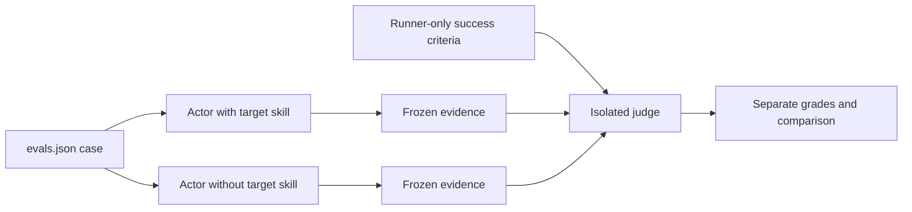
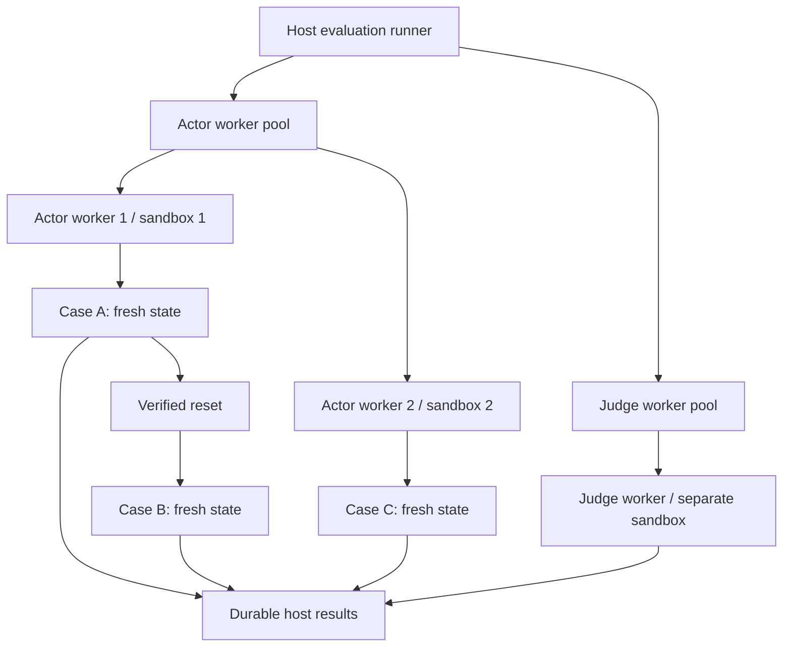
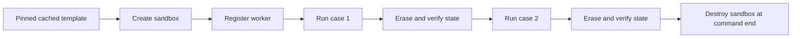
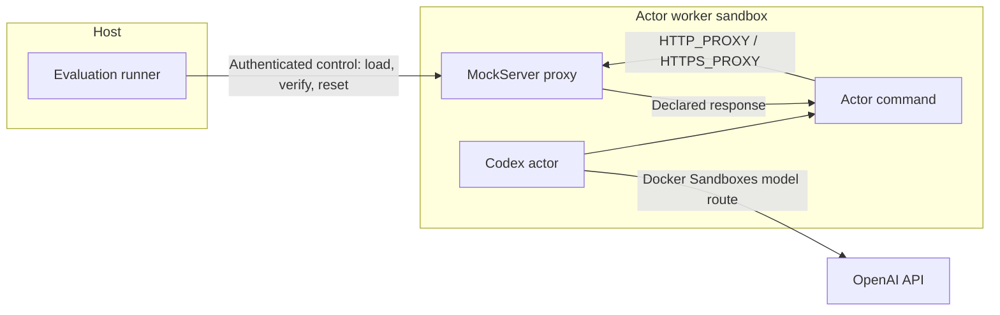
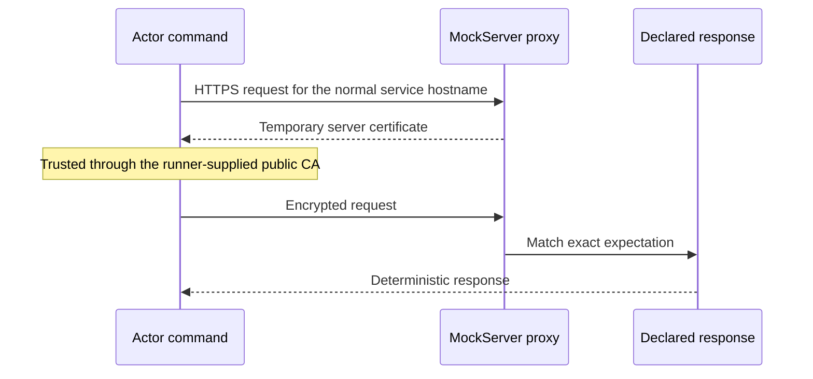
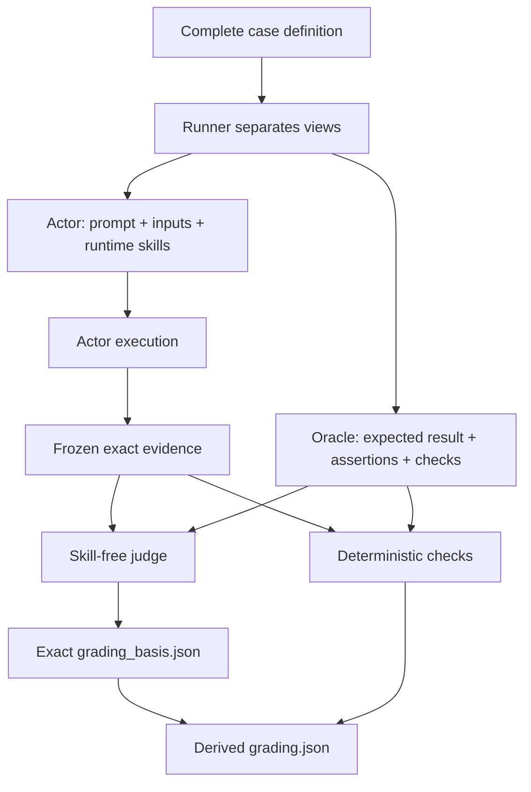

# Evaluation

The repository combines deterministic validation with opt-in model-backed
evaluation. Skill authors define cases; one generic harness discovers and runs
them for every skill.

## Test Layers

| Layer | Purpose | Model use |
| --- | --- | --- |
| `validate static` | Skill layout, frontmatter, references, JSON definitions, fixtures, secrets, and Agent Skills conformance | None |
| `validate runtime` | Deterministic tests for non-trivial bundled scripts | None |
| `validate ci-all` | Complete routine pull-request gate | None |
| `validate triggers` | Whether the harness selects the skill for realistic and near-miss requests | Actor only |
| `validate evals` | Whether the skill improves task behavior and output | Actors and judges |
| `validate all` | Trigger and behavior suites through one runtime preflight | Actors and judges |

`validate ci-all` is offline and model-free:

```bash
scripts/ai-skills validate ci-all
```

Its unit and bundled-script subprocesses receive only an allowlisted
environment plus fresh home and temporary directories. The runner drains raw
stdout and stderr under a 4 MiB limit per stream, terminates a process that
exceeds either limit, and displays output only after byte-level secret
scanning. Each subprocess receives a separate process group, and inherited
descendants are terminated before the runner returns. Overflow or
high-confidence secret material quarantines the output and fails the
deterministic gate.

Unit and runtime suites are reviewed repository code executed on the host.
Their snapshots, restricted environment, output limits, and process groups are
deterministic hygiene, not an adversarial sandbox. They do not contain code
that deliberately creates a new process session. Model-driven or otherwise
untrusted execution uses Docker Sandboxes instead.

Model-backed commands run only after explicit user approval. A skill change,
review, or pull-request request is not approval. Before model execution, the
CLI prints the exact actor and judge counts, preflight count, concurrency, and
external result path.

## Terminology

| Term | Meaning |
| --- | --- |
| Invocation | One CLI evaluation command and its declared complete run set |
| Case | One authored behavior scenario in `evals.json` |
| Query | One authored pickup scenario in `triggers.json` |
| Variant | A configured view of a scenario, such as `with_skill` or `without_skill` |
| Attempt | One concrete execution of one case or query variant and run ordinal |
| Run count | How many attempts are requested for each selected trigger query |
| Worker | The runner's reusable role-specific handle for one sandbox |
| Sandbox | One isolated Docker Sandboxes microVM |

## Behavior Evaluation

Each case in `evals/evals.json` runs twice under the same prompt, tools, model,
fixtures, and policy:

1. `with_skill` receives the complete skill catalog.
2. `without_skill` receives the same catalog with only the target removed.

Both outputs are graded against the same oracle. The baseline shows what the
skill adds; only the `with_skill` grade determines the behavior case result.
Variant identity remains runner-only and is never included in the judge control
or judge-visible transcript. The invocation declaration and offline aggregator
both require every behavior attempt in one aggregation group to bind to the
same judge-control digest.
Before declaration and again before actor execution, the runner also requires
exactly one `with_skill` and one `without_skill` attempt with matching run,
aggregation, contribution, and comparison identities. Offline aggregation
rejects any persisted behavior attempt whose run and aggregation variants
disagree. Each arm is also bound to the same complete selected case definition,
so matching IDs cannot hide different prompts, assertions, checks, or fixtures.
The shared `scenario_definition_sha256` covers that variant-independent case
definition, prepared inputs, fixture initialization, deterministic schemas, and
judge control. Declaration and offline aggregation require both arms to share
it, the assertion contract, and the deterministic-input digest.
The `without_skill` attempt fails closed if the adapter reports the target in
`successful_skill_reads`, identifies its canonical installed `SKILL.md` as
`expected_skill_path`, or preserves a structured `skill_read` event for that
path. Every path in those structured fields must be an absolute canonical POSIX
path: dot segments, parent traversal, duplicate separators, NULs, and
backslashes are rejected without filesystem resolution. The same path and event
checks run again during offline aggregation; mentions in ordinary model prose
are not used as contamination evidence.



The actor sees the user prompt, selected runtime skill projection, and declared
inputs. It does not see expected output, assertions, deterministic schemas,
proxy expectations, grades, or trigger answers. Prompts therefore describe
available commands and data as ordinary task capabilities rather than
announcing fixture or evaluation mechanics.

Deterministic checks inspect hard artifact contracts before semantic judging.
Model prose is assessed semantically; exact phrase matching is deliberately not
supported.

Run all behavior cases or narrow the run:

```bash
scripts/ai-skills validate evals --harness codex
scripts/ai-skills validate evals \
  --harness codex --skill <skill-name> --case <case-id>
```

The Claude adapter boundary is reserved, but Claude model-backed execution is
not currently implemented. Codex is the supported evaluation harness.

## Trigger Evaluation

Trigger cases use `evals/triggers.json`. The actor receives the full public
catalog and a query but is not told which skill is expected. For Codex, pickup
is proven only by a successful command event that reads the exact installed
target `SKILL.md`; mentioning a skill name is not proof. The adapter translates
its descriptor-verified host path to the single canonical logical evidence path
`/case/codex-home/skills/<skill>/SKILL.md` before returning the execution.

Positive cases require that read. Negative cases require its absence after the
runner has proven the expected target path existed before execution and the
actor completed one valid thread and turn lifecycle. A positive read must
immediately follow its matched trusted-reader command completion with the same
command ID, zero exit status, and successful terminal status. The live runner
and offline aggregator derive pickup from this same lifecycle validator;
standalone, failed, unmatched, duplicated, or out-of-order read markers are not
evidence. Every non-command tool start and completion is likewise paired by
tool ID and type; unknown lifecycle events fail the attempt. Every configured
repetition is bound to the same complete selected query, expectation, ordinal,
assertion contract, and aggregation policy. Trigger grading is deterministic
and does not call a separate judge.
Repeated trigger attempts share one `scenario_definition_sha256`, runtime-input
digest, expected activation, installed catalog path, assertion contract, and
aggregation policy; only the run identity and ordinal may differ.
Trigger attempts capture actor-created files through the same frozen output
boundary used by behavior attempts. Live validation requires
`expected_skill_path`, target entries in `successful_skill_reads`, and derived
target `skill_read` events to use the exact logical path. Canonical reads for
unrelated skills do not activate the target; foreign roots and other
noncanonical skill paths invalidate the attempt.

```bash
scripts/ai-skills validate triggers --harness codex
scripts/ai-skills validate triggers \
  --harness codex --skill <skill-name> --query <query-id> --runs 3
```

Each query runs once by default. `--runs 2` or `--runs 3` applies uniformly to
every selected query. Unanimous outcomes are stable. A two-of-three match can
meet the threshold only after the discordant attempt is investigated and the
preserved results receive complete validated manual grading for every attempt.
The reviewer then aggregates with `--grade-source manual` or
`--grade-source both`; judge-only aggregation rejects the pending result.
Other disagreement fails.

## Sandboxes, Workers, And Cases

Model-backed evaluations use [Docker Sandboxes](https://docs.docker.com/ai/sandboxes/).
A sandbox is the isolated microVM. A worker is the runner's role-specific
handle for one live sandbox. Each attempt receives fresh case state: a user,
workspace, `CODEX_HOME`, and harness session.



Workers are reused within one command to control cost. Attempt state is not.
Pinned templates and images provide caching across commands.

Worker registration binds the sandbox name to the UUID reported by `sbx ls`.
The runtime keeps state keyed by that UUID, verifies the binding before
cleanup, and addresses Docker Sandbox CLI operations by the verified name.
Removal succeeds only when a fresh listing proves that neither the UUID nor a
same-name replacement remains.



If reset, process cleanup, mount verification, or evidence capture cannot be
proven, the attempt fails and the worker is destroyed. Durable results stay
outside actor mounts. Authentication uses Docker Sandboxes' host proxy; the
runner does not copy the user's Codex home or credentials into a case.
Docker's generated non-secret Codex profile and auth placeholder must match the
pinned bytes and parsed structure before actor or judge execution begins.

The runner proves process cleanup from both `cgroup.events` and `cgroup.procs`.
An already-empty cgroup is verified twice without another kill; a populated
cgroup is frozen, killed, and then proven empty. The cgroup is removed during
quiescence, so the next case never depends on volatile kernel state surviving a
sandbox restart.

Runtime subprocesses always receive closed standard input. Prompts are passed
explicitly to Codex, so running the CLI from a PTY, CI, or another agent has the
same behavior. A timed-out worker is destroyed and reported as a timeout; the
resulting removal of its skill projection is not reported as skill tampering.
Projection integrity remains mandatory for every completed run.

The runner seeds each case from its host projection into the bounded tmpfs
through a private root-only bridge under `/run/ai-skills-evals/`. The actor sees
the tmpfs workspace but cannot traverse the bridge back to the underlying host
projection. During execution, the ordinary worker host projection is remounted
read-only, so the actor cannot use it as an unbounded writable path. Reset
exports permitted outputs, unmounts the case tree, removes the case-specific
bridge, and returns the worker projection to read-write before reuse. Public
skill entries are sealed and verified only in their final actor-visible tmpfs
location. The sticky catalog root lets Codex replace its own `.system` entry
without permitting changes to root-owned public skills. After the actor stops,
the actor projection remains read-only while the runner collects evidence.
Only the later verified reset may return the worker projection to read-write.
Before execution, a case-user mount-table probe permits only the case-owned
tmpfs mounts plus a narrow set of kernel pseudo-filesystems. It recursively
checks every other mounted filesystem, including secondary devices, and
recycles the worker if any actor-writable persistent path is exposed.

Before the first approved model-backed run, follow Docker's
[Sandboxes setup guide](https://docs.docker.com/ai/sandboxes/get-started/) and
configure host-proxied Codex authentication:

```bash
sbx login
sbx secret set -g openai --oauth
```

The actor retains the pinned normal sandbox network policy so it can perform a
realistic task. The isolation goal is reproducible case state and protection of
host data, not blocking every actor network request.

## Fixtures And Integrations

Create fixtures per case only when the scenario needs controlled data or
collaborators:

```text
evals/fixtures/<eval-id>/
├── inputs/                         actor-visible files
│   └── bin/<command>              optional executable collaborator
├── mockserverInitialization.json  optional HTTP(S) expectations
└── <schema>.json                  optional runner-only output schema
```

Only paths listed in the case's `files` array enter the actor workspace.
Executable files staged under `inputs/bin/` are automatically placed on the
actor command `PATH`. The prompt names the command and its useful contract, not
the fact that it is a shim. Make its interface behave like the real CLI it
represents.

Declared actor inputs or HTTP initialization let prompts use natural owner
phrasing such as "my repository" without calling the data a fixture. A prompt
with private-state wording and no isolated case resources fails validation.
Explicit requests for live, production, real, private, or logged-in resources
still fail even when fixtures exist; no case receives real credentials or
private sessions.

Choose the smallest suitable pattern:

| Dependency | Preferred fixture |
| --- | --- |
| Input document or repository state | Declared files below `inputs/` |
| External CLI or unavailable local tool | Executable command under `inputs/bin/` |
| REST or GraphQL API | Exact MockServer HTTP(S) expectations |
| WebSocket interaction | A deterministic transcript or specialized local fixture |
| Certificate behavior | Ephemeral worker CA and server certificates managed by the proxy |
| Sensitive configuration | Non-secret placeholders whose values start with `FAKE_` |

Static validation scans every fixture byte for high-confidence credential
patterns, including binary files; invalid UTF-8 and NUL bytes do not disable
that scan. JSON fixtures still require valid UTF-8 for parsing, and decoded
JSON strings are scanned again so Unicode escapes cannot hide credentials.

For production-shaped HTTP(S), the runner starts one case-scoped MockServer
container inside the selected actor worker. Commands launched by Codex receive
proxy variables; Codex's own model route remains separate. Docker log
persistence is disabled for the fixture sidecar and its preflight canary;
bounded authenticated request evidence remains the sole request record.



Requests keep their production-shaped hostname and URL. The proxy intercepts
them, matches exact method, host, path, query, and relevant body fields, and
returns the declared response. Any unmatched request that reaches MockServer
fails and is never forwarded to production. MockServer is not a general egress
firewall; the pinned sandbox network policy governs traffic that does not use
the proxy, and cases never receive real service credentials.

Before cases run, preflight reads MockServer's authenticated live configuration
and requires unmatched proxying to be disabled. It then starts a disposable
canary from the same pinned image, routes one unmatched request toward it, and
requires a 404 with no canary request recorded. Preflight also attempts the
actual `PUT` reset operation without credentials and proves that a sentinel
expectation is unchanged. The runner stages the authenticated sentinel,
verification, and reset controls before any actor command. Successful
fixture probes are followed by case quiescence and projection deactivation;
only then does the runner destroy the preflight sidecar, control directory, and
generated CA. Codex version, flag, and model probes continue in a fresh case,
never the retired fixture-preflight case. Any failed quiescence, retirement, or
case reset invalidates the worker and drops its fixture state. Post-actor
verification consumes staged controls, then destroys the sidecar and generated
certificate state without changing the actor projection.

For HTTPS, MockServer presents a temporary server certificate for the requested
hostname. Actor commands trust the worker's public test CA. The actor receives
no CA private key or client certificate. Dynamic certificate updates are
disabled. For every case, the runner replaces the worker's certificate subject
configuration with exactly that case's declared DNS names and IP addresses and
verifies both the effective configuration and a real proxied HTTPS handshake
for every subject. After successful collection it removes the sidecar and
certificate directory. A later case can reuse the worker only with a fresh
sidecar and a newly generated CA.



MockServer definitions are declarative and fail closed. They allow static
responses or errors only, exact request matchers, finite call counts, and at
most 128 declared calls. Forwarding, callbacks, executable templates, delays,
generated responses, file-backed response bodies, and unbounded repetition are
forbidden. Every declared call is verified before grading.

Exact actor outputs remain available to the judge and human reviewer. Proxy
request metadata is runner control-plane telemetry: it is bounded and sanitized
before persistence and is not presented as an exact copy of an actor artifact.

## Judges And Grading

After an actor stops, the runner freezes its response, transcript, normalized
execution trace, and changed output files. All evidence is treated as
untrusted.



Judge workers are separate from actors. They receive no public skill catalog, actor
workspace, fixture controls, shell, or web access. A response schema requires
one pass/fail verdict and concrete evidence for every assertion. There are no
hidden actor or judge retries. The assertion list and grading authority are
declared before execution. The live runner and offline aggregator require the
same exact ordered successful judge lifecycle, with no missing, reordered, or
additional event. Any observed skill read, command, tool use, actor-output
capture, or actor workspace access invalidates the judge run. Codex bundled
skills and skill-instruction injection are disabled explicitly, and the runner
verifies before and after execution that the judge catalog contains only
Codex's required empty `.system` directory. The runner preserves the exact safe
judge response, deterministic definitions and schemas, and deterministic check
results in `grading_basis.json`. It also preserves the judge control, admitted
artifact set, and digest of the exact prompt sent to the judge. Offline
aggregation reconstructs that prompt from the actor events that preceded the
judge lifecycle, validates the skill-free judge execution, reparses the
response, reruns the hard checks from the preserved output snapshot, and
requires `grading.json` to be the exact derived form. The transcript contains
the task prompt and actor response without revealing the behavior arm. Timing
and arm identity are preserved for runner accounting but are not admitted as
judge evidence.

Generated grades remain immutable. A human reviewer can inspect the same
evidence and add a complete `manual_grading.json` using the grading schema.
Human grades identify the reviewer with a non-empty `reviewer_identity` or
`reviewer_label`. Their model and reasoning fields are `null`, and their
`graded_at` is a distinct manual-review time later than the generated grade and
not earlier than the completed attempt.
Offline aggregation can use judge, manual, or both sources:

```bash
scripts/ai-skills evals aggregate \
  --results-dir <result-directory> \
  --grade-source judge|manual|both
```

With `both`, both summaries remain visible and the complete manual grade is the
effective override. Manual review never edits `grading.json`.

To grade manually, copy that attempt's generated `grading.json` to
`manual_grading.json`, then:

1. Keep `schema_version`, run identity, `evidence_sha256`, assertion IDs
   and text, and `aggregation` unchanged.
2. Set `grade_source` to `manual`.
3. Set `grader.type` to `human`, set model and reasoning fields to `null`, and
   use a non-empty review version such as `manual-v1`. Add a non-empty
   `grader.reviewer_identity` or `grader.reviewer_label`.
4. Record the review time in `graded_at`; it must be later than the generated
   grade timestamp and not earlier than the attempt's `timing.json` `ended_at`.
5. Set every assertion's `checked_by` to `human`. Re-evaluate semantic
   assertions and update their `passed`, concrete `evidence`, `evidence_refs`,
   and the summary totals. For deterministic assertions, preserve `passed`,
   `evidence`, and `evidence_refs` exactly; human review cannot override a hard
   contract result.
6. Validate the result by running the offline aggregate command.

For trigger attempts, activation is a runner-observed fact rather than a
semantic judgment. Manual grading may add human review metadata, but it must
preserve the recorded activation outcome, deterministic activation assertion,
evidence references, and trigger-rate measurements.

The exact record contract is
[`grading.schema.json`](../schemas/ai-skills/grading.schema.json).

## Results

Each single-suite invocation writes a collision-safe directory outside the
repository:

```text
summary.md
invocation.json
benchmark.json                             only after trustworthy aggregation
attempts/<attempt>/attempt.json
attempts/<attempt>/outputs/response.md
attempts/<attempt>/outputs/<changed actor files>
attempts/<attempt>/transcript.md
attempts/<attempt>/execution_trace.jsonl
attempts/<attempt>/timing.json
attempts/<attempt>/grading_basis.json      behavior runs after successful judging
attempts/<attempt>/grading.json            only after successful grading
attempts/<attempt>/manual_grading.json     optional, human-authored
```

`validate all` creates a collection with two independently declared sub-runs:

```text
summary.md
triggers/
  summary.md
  invocation.json
  attempts/...
evals/
  summary.md
  invocation.json
  attempts/...
```

Each sub-run writes its own `benchmark.json` only when its full attempt set is
trustworthy and complete. A failed attempt preserves its safe runner-owned
response, transcript, trace, and timing, clears ungraded actor-created files,
and does not invent `grading.json`. A two-of-three trigger disagreement remains
pending review and similarly defers automatic benchmark generation.

For a completed attempt, `outputs/` contains the response plus safe files the
actor created or changed in its workspace. Every captured pathname and file
body is scanned under one bounded sensitive-content budget before grading;
unsafe or incompletely scanned output quarantines the attempt and removes those
actor-created files from durable incomplete evidence. `summary.md` is the human
entry point.
`invocation.json` and each `attempt.json` declare the exact expected run set and
assertion contract. A fresh random `invocation_id` is created before preflight
and repeated in every structured attempt artifact and the final benchmark, so
an otherwise valid artifact from an older run cannot satisfy the current
invocation. `timing.json` records model usage and duration.
`grading_basis.json` preserves the exact judge response, control, prompt digest,
admitted actor evidence, and deterministic definitions, schemas, and results
for behavior runs. `grading.json` records the derived automatic verdicts and
evidence. `benchmark.json` aggregates trustworthy completed attempts and
preserves with-skill/baseline comparisons or trigger rates.
Generated JSON uses one 4 MiB writer and reader ceiling. Oversized invocation
plans fail before runtime preflight, and each case's deterministic schemas are
limited to 512 KiB in aggregate so an accepted case can preserve its grading
basis. Captured-output entry limits are derived from the complete per-attempt
artifact layout. Before accepting a completed attempt, the writer checks the
whole invocation tree, reserves entries for the full attempt layout, and
reserves byte capacity for `benchmark.json` and `summary.md`. This keeps every
accepted result within the same limits later enforced by aggregation.

Every generated grading record binds to the complete preserved evidence through
`evidence_sha256`: the attempt declaration, timing, response, transcript,
execution trace, and every actor-created output file and directory. Behavior
evidence also binds the grading basis. The writer verifies fixed evidence before treating
`grading.json` as a completion marker. Aggregation independently recomputes the
digest, reparses the exact judge response against the immutable assertion
contract, reconstructs and reruns every deterministic check against the
snapshotted outputs, and rejects any generated grade it cannot reproduce
exactly. If publication or durability fails, the completion marker is removed
and actor-created outputs are quarantined before the failure returns.

Each attempt manifest binds its variant- or run-specific prepared runtime inputs
with `runtime_input_sha256` and its shared authored scenario with
`scenario_definition_sha256`. Behavior attempts separately bind deterministic
check and schema inputs with `deterministic_input_sha256`. These values are
declared before preflight and rechecked after preflight before any model call.
Preflight
returns an internal receipt bound to the invocation command, file identity,
content digest, fixture requirement, and exact harness adapter; execution
cannot accept raw capabilities in its place or reuse another adapter's receipt.
The receipt also pins actor and judge model and reasoning configurations.
Requests pass those exact values to the pinned Codex CLI through `--model` and
`model_reasoning_effort`. The adapter records them only from the bound request;
it never infers execution metadata from preflight defaults. Codex JSONL does
not report an independent backend model identity, so persisted model fields
mean configured request values rather than backend-routing attestation.
Aggregation rejects harness, actor-model-configuration, or generated
judge-model-configuration drift across the complete invocation, including when
manual grades are selected. Replacing an invocation file with byte-identical
content still invalidates the run because its opened file identity is part of
the declaration.

Every actor and judge request also carries a fresh execution binding derived
from `invocation_id`, logical `run_id`, role, and the SHA-256 digest of the
canonical request. The adapter must echo that exact binding in
`HarnessExecution`; a missing, stale, or altered binding is rejected before
response, trace, timing, or grading evidence is trusted. Actor bindings are
preserved in `timing.json`, and judge bindings in `grading_basis.json`.
Offline aggregation verifies each binding's digest and requires its invocation,
run, and role to match the immutable attempt.

The adapter recomputes the canonical digest at the execution boundary, so a
request changed after binding cannot run. Actor-visible skills, inputs, and
fixture initialization must already be immutable prepared bytes; path-backed
runtime material is rejected after binding.
Judge response schemas are likewise materialized once before binding. Their
canonical bytes are both covered by the request digest and staged for Codex, so
mutable caller mappings cannot change the executed schema.

The runner also pins the result root, attempts directory, attempt directory,
generated artifact directories, and repository identity. Every write or
cleanup reopens and verifies that exact chain and proves the result root has
not been relocated into the repository. Actor output capture and restoration
use pinned attempt and `outputs/` directory handles. If a path is substituted,
the attempt fails without writing to or deleting from the replacement.

Trigger attempts also declare `expected_activation` in the immutable invocation
and attempt manifests. They also declare the canonical logical Codex catalog
path for the target. Aggregation accepts a trigger grade only when that
expectation, one derived activation event, the underlying exact `skill_read`
event, `timing.json` skill-read fields, the exact
`/case/codex-home/skills/<skill>/SKILL.md` logical path, the complete
deterministic assertion, and trigger-rate measurements agree. Prefixes such as
`/attacker-controlled/case/...` are rejected even when the remaining path
matches. The reader operand must be the exact raw canonical path; dot segments,
duplicate separators, and other aliases are rejected before normalization. A
successful read must use a trusted absolute system reader and return bytes
exactly equal to the prepared installed `SKILL.md`; command text alone is not
activation evidence.

Aggregation rejects missing, injected, changed, partial, or untrustworthy
attempts. Exit code `0` means the effective grades pass, `1` means trustworthy
evaluated assertions fail, and `2` means the evidence or invocation is invalid.
For Codex, an exit-0 response with a complete structured lifecycle remains
successful when stderr contains informational status output. Stderr is
forwarded as a bounded diagnostic only when the exit or lifecycle fails.
Runner-owned cgroup checks likewise use the pinned script's exit status and
empty stdout as their proof contract, so a non-fatal Docker host warning does
not invalidate a successful check. When a timeout or lifecycle failure destroys
the worker, that intentional projection removal is not labeled as skill
tampering; completed runs still require exact post-run projection integrity.

## Real Runtime Smoke Tests

Unit tests exercise a fake `sbx` boundary under `validate ci-all`. Real Docker
Sandboxes, Codex, and MockServer integration checks are separate because they
use saved authentication and may consume model quota:

```bash
AI_SKILLS_RUN_MODEL_INTEGRATION=1 \
  python3 -m unittest \
  tests.integration.eval_runtime.test_docker_sandboxes_smoke \
  tests.integration.eval_runtime.test_fixture_proxy_smoke
```

Run these only after an explicit user request. Setting the environment variable
is an additional guard, not approval by itself.
