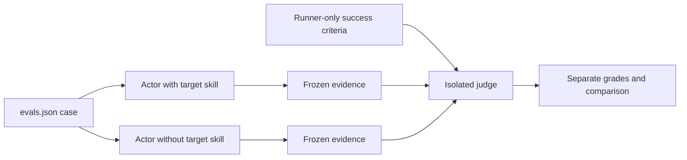
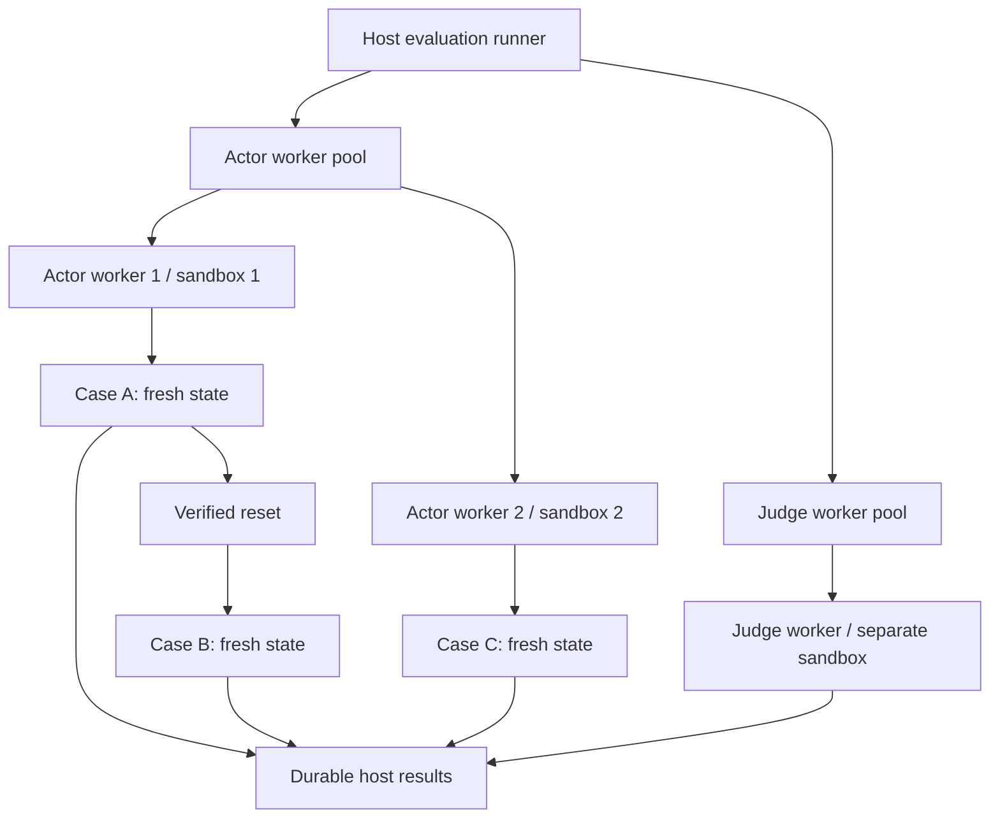
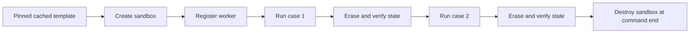
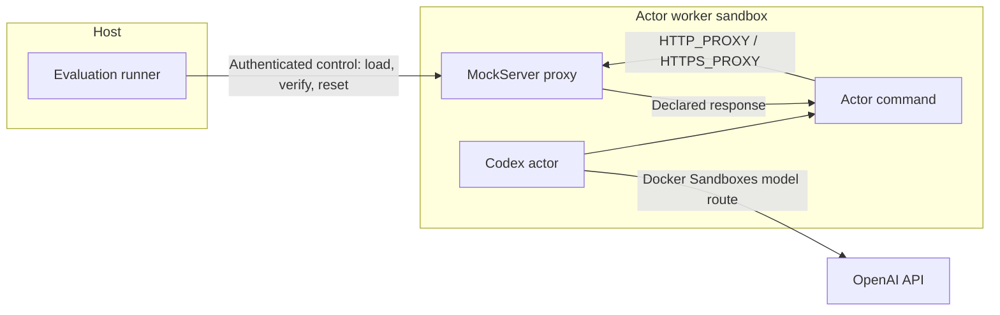
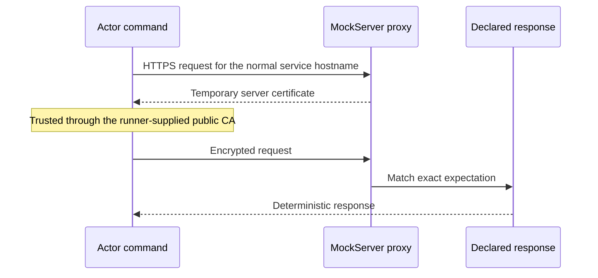
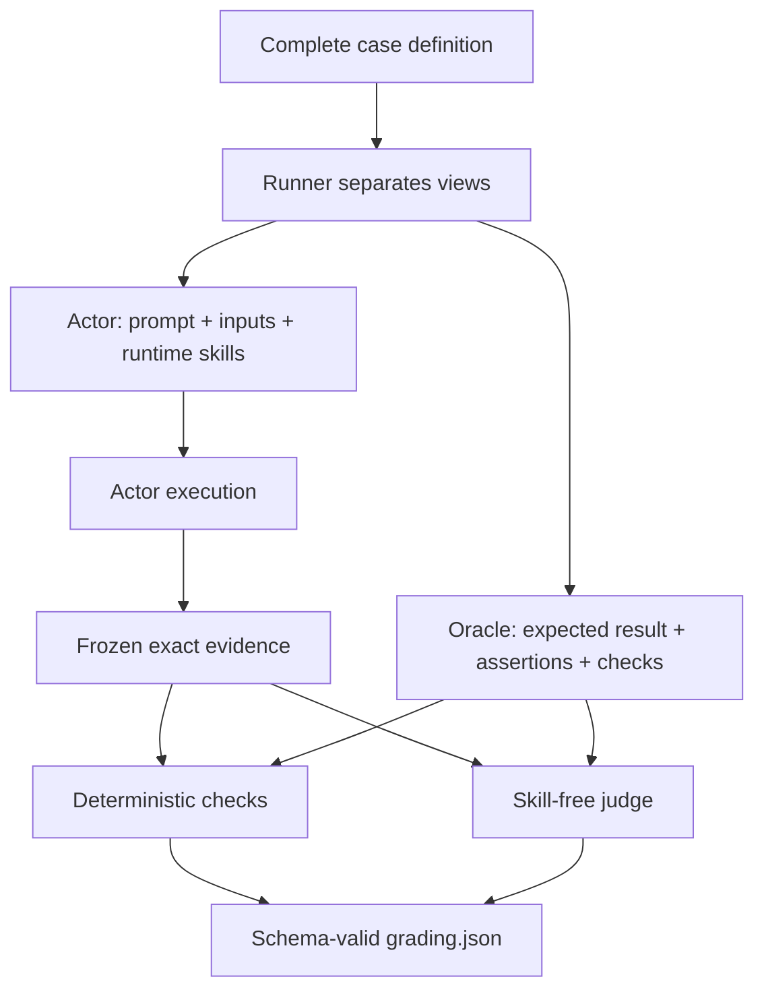

# Evaluation

The repository combines deterministic validation with opt-in model-backed
evaluation. Skill authors define cases; one generic harness discovers and runs
them for every skill.

## Test Layers

| Layer | Purpose | Model use |
| --- | --- | --- |
| `validate static` | Skill layout, frontmatter, references, JSON definitions, fixtures, secrets, and Agent Skills conformance | None |
| `validate runtime` | Deterministic tests for non-trivial bundled scripts | None |
| `validate ci-all` | Complete routine pull-request gate | None |
| `validate triggers` | Whether the harness selects the skill for realistic and near-miss requests | Actor only |
| `validate evals` | Whether the skill improves task behavior and output | Actors and judges |
| `validate all` | Trigger and behavior suites through one runtime preflight | Actors and judges |

`validate ci-all` is offline and safe to run routinely:

```bash
python3 scripts/ai_skills.py validate ci-all
```

Model-backed commands run only after explicit user approval. A skill change,
review, or pull-request request is not approval. Before model execution, the
CLI prints the exact actor and judge counts, preflight count, concurrency, and
external result path.

## Terminology

| Term | Meaning |
| --- | --- |
| Invocation | One CLI evaluation command and its declared complete run set |
| Case | One authored behavior scenario in `evals.json` |
| Query | One authored pickup scenario in `triggers.json` |
| Variant | A configured view of a scenario, such as `with_skill` or `without_skill` |
| Attempt | One concrete execution of one case or query variant and run ordinal |
| Run count | How many attempts are requested for each selected trigger query |
| Worker | The runner's reusable role-specific handle for one sandbox |
| Sandbox | One isolated Docker Sandboxes microVM |

## Behavior Evaluation

Each case in `evals/evals.json` runs twice under the same prompt, tools, model,
fixtures, and policy:

1. `with_skill` receives the complete skill catalog.
2. `without_skill` receives the same catalog with only the target removed.

Both outputs are graded against the same oracle. The baseline shows what the
skill adds; only the `with_skill` grade determines the behavior case result.



The actor sees the user prompt, selected runtime skill projection, and declared
inputs. It does not see expected output, assertions, deterministic schemas,
proxy expectations, grades, or trigger answers. Prompts therefore describe
available commands and data as ordinary task capabilities rather than
announcing fixture or evaluation mechanics.

Deterministic checks inspect hard artifact contracts before semantic judging.
Model prose is assessed semantically; exact phrase matching is deliberately not
supported.

Run all behavior cases or narrow the run:

```bash
python3 scripts/ai_skills.py validate evals --harness codex
python3 scripts/ai_skills.py validate evals \
  --harness codex --skill <skill-name> --case <case-id>
```

The Claude adapter boundary is reserved, but Claude model-backed execution is
not currently implemented. Codex is the supported evaluation harness.

## Trigger Evaluation

Trigger cases use `evals/triggers.json`. The actor receives the full public
catalog and a query but is not told which skill is expected. For Codex, pickup
is proven only by a successful command event that reads the exact installed
target `SKILL.md`; mentioning a skill name is not proof.

Positive cases require that read. Negative cases require its absence after the
runner has proven the expected target path existed before execution. Trigger
grading is deterministic and does not call a separate judge.

```bash
python3 scripts/ai_skills.py validate triggers --harness codex
python3 scripts/ai_skills.py validate triggers \
  --harness codex --skill <skill-name> --query <query-id> --runs 3
```

Each query runs once by default. `--runs 2` or `--runs 3` applies uniformly to
every selected query. Unanimous outcomes are stable. A two-of-three match can
meet the threshold only after the discordant attempt is investigated and the
preserved results are explicitly aggregated; other disagreement fails.

## Sandboxes, Workers, And Cases

Model-backed evaluations use [Docker Sandboxes](https://docs.docker.com/ai/sandboxes/).
A sandbox is the isolated microVM. A worker is the runner's role-specific
handle for one live sandbox. Each attempt receives fresh case state: a user,
workspace, `CODEX_HOME`, and harness session.



Workers are reused within one command to control cost. Attempt state is not.
Pinned templates and images provide caching across commands.



If reset, process cleanup, mount verification, or evidence capture cannot be
proven, the attempt fails and the worker is destroyed. Durable results stay
outside actor mounts. Authentication uses Docker Sandboxes' host proxy; the
runner does not copy the user's Codex home or credentials into a case.

Before the first approved model-backed run, follow Docker's
[Sandboxes setup guide](https://docs.docker.com/ai/sandboxes/get-started/) and
configure host-proxied Codex authentication:

```bash
sbx login
sbx secret set -g openai --oauth
```

The actor retains the pinned normal sandbox network policy so it can perform a
realistic task. The isolation goal is reproducible case state and protection of
host data, not blocking every actor network request.

## Fixtures And Integrations

Create fixtures per case only when the scenario needs controlled data or
collaborators:

```text
evals/fixtures/<eval-id>/
├── inputs/                         actor-visible files
│   └── bin/<command>              optional executable collaborator
├── mockserverInitialization.json  optional HTTP(S) expectations
└── <schema>.json                  optional runner-only output schema
```

Only paths listed in the case's `files` array enter the actor workspace.
Executable files staged under `inputs/bin/` are automatically placed on the
actor command `PATH`. The prompt names the command and its useful contract, not
the fact that it is a shim. Make its interface behave like the real CLI it
represents.

Declared actor inputs or HTTP initialization let prompts use natural owner
phrasing such as "my repository" without calling the data a fixture. A prompt
with private-state wording and no isolated case resources fails validation.
Explicit requests for live, production, real, private, or logged-in resources
still fail even when fixtures exist; no case receives real credentials or
private sessions.

Choose the smallest suitable pattern:

| Dependency | Preferred fixture |
| --- | --- |
| Input document or repository state | Declared files below `inputs/` |
| External CLI or unavailable local tool | Executable command under `inputs/bin/` |
| REST or GraphQL API | Exact MockServer HTTP(S) expectations |
| WebSocket interaction | A deterministic transcript or specialized local fixture |
| Certificate behavior | Ephemeral worker CA and server certificates managed by the proxy |
| Sensitive configuration | Non-secret placeholders whose values start with `FAKE_` |

For production-shaped HTTP(S), the runner starts one MockServer container in
each actor worker. Commands launched by Codex receive proxy variables; Codex's
own model route remains separate.



Requests keep their production-shaped hostname and URL. The proxy intercepts
them, matches exact method, host, path, query, and relevant body fields, and
returns the declared response. Any unmatched request that reaches MockServer
fails and is never forwarded to production. MockServer is not a general egress
firewall; the pinned sandbox network policy governs traffic that does not use
the proxy, and cases never receive real service credentials.

For HTTPS, MockServer presents a temporary server certificate for the requested
hostname. Actor commands trust the worker's public test CA. The actor receives
no CA private key or client certificate.



MockServer definitions are declarative and fail closed. They allow static
responses or errors only, exact request matchers, finite call counts, and at
most 128 declared calls. Forwarding, callbacks, executable templates, delays,
generated responses, file-backed response bodies, and unbounded repetition are
forbidden. Every declared call is verified before grading.

Exact actor outputs remain available to the judge and human reviewer. Proxy
request metadata is runner control-plane telemetry: it is bounded and sanitized
before persistence and is not presented as an exact copy of an actor artifact.

## Judges And Grading

After an actor stops, the runner freezes its response, transcript, normalized
execution trace, and changed output files. All evidence is treated as
untrusted.



Judge workers are separate from actors. They receive no skill catalog, actor
workspace, fixture controls, shell, or web access. A response schema requires
one pass/fail verdict and concrete evidence for every assertion. There are no
hidden actor or judge retries.

Generated grades remain immutable. A human reviewer can inspect the same
evidence and add a complete `manual_grading.json` using the grading schema.
Offline aggregation can use judge, manual, or both sources:

```bash
python3 scripts/ai_skills.py evals aggregate \
  --results-dir <result-directory> \
  --grade-source judge|manual|both
```

With `both`, both summaries remain visible and the complete manual grade is the
effective override. Manual review never edits `grading.json`.

To grade manually, copy that attempt's generated `grading.json` to
`manual_grading.json`, then:

1. Keep `schema_version`, run identity, assertion IDs and text, and
   `aggregation` unchanged.
2. Set `grade_source` to `manual`.
3. Set `grader.type` to `human`, set model and reasoning fields to `null`, and
   use a non-empty review version such as `manual-v1`.
4. Record the review time in `graded_at`.
5. Re-evaluate every assertion, updating `passed`, `checked_by`, concrete
   `evidence`, `evidence_refs`, and the summary totals.
6. Validate the result by running the offline aggregate command.

The exact record contract is
[`grading.schema.json`](../schemas/ai-skills/grading.schema.json).

## Results

Each single-suite invocation writes a collision-safe directory outside the
repository:

```text
summary.md
invocation.json
benchmark.json                             only after trustworthy aggregation
attempts/<attempt>/attempt.json
attempts/<attempt>/outputs/response.md
attempts/<attempt>/outputs/<changed actor files>
attempts/<attempt>/transcript.md
attempts/<attempt>/execution_trace.jsonl
attempts/<attempt>/timing.json
attempts/<attempt>/grading.json            only after successful grading
attempts/<attempt>/manual_grading.json     optional, human-authored
```

`validate all` creates a collection with two independently declared sub-runs:

```text
summary.md
triggers/
  summary.md
  invocation.json
  attempts/...
evals/
  summary.md
  invocation.json
  attempts/...
```

Each sub-run writes its own `benchmark.json` only when its full attempt set is
trustworthy and complete. A failed attempt still preserves the safe evidence
and timing that exist, but it does not invent `grading.json`. A two-of-three
trigger disagreement remains pending review and similarly defers automatic
benchmark generation.

`outputs/` contains the response plus safe files the actor created or changed
in its workspace. `summary.md` is the human entry point. `invocation.json` and each
`attempt.json` declare the exact expected run set. `timing.json` records model
usage and duration. `grading.json` records automatic verdicts and evidence.
`benchmark.json` aggregates trustworthy completed attempts and preserves
with-skill/baseline comparisons or trigger rates.

Aggregation rejects missing, injected, changed, partial, or untrustworthy
attempts. Exit code `0` means the effective grades pass, `1` means trustworthy
evaluated assertions fail, and `2` means the evidence or invocation is invalid.

## Real Runtime Smoke Tests

Unit tests exercise a fake `sbx` boundary under `validate ci-all`. Real Docker
Sandboxes, Codex, and MockServer integration checks are separate because they
use saved authentication and may consume model quota:

```bash
AI_SKILLS_RUN_MODEL_INTEGRATION=1 \
  python3 -m unittest \
  tests.integration.eval_runtime.test_docker_sandboxes_smoke \
  tests.integration.eval_runtime.test_fixture_proxy_smoke
```

Run these only after an explicit user request. Setting the environment variable
is an additional guard, not approval by itself.
